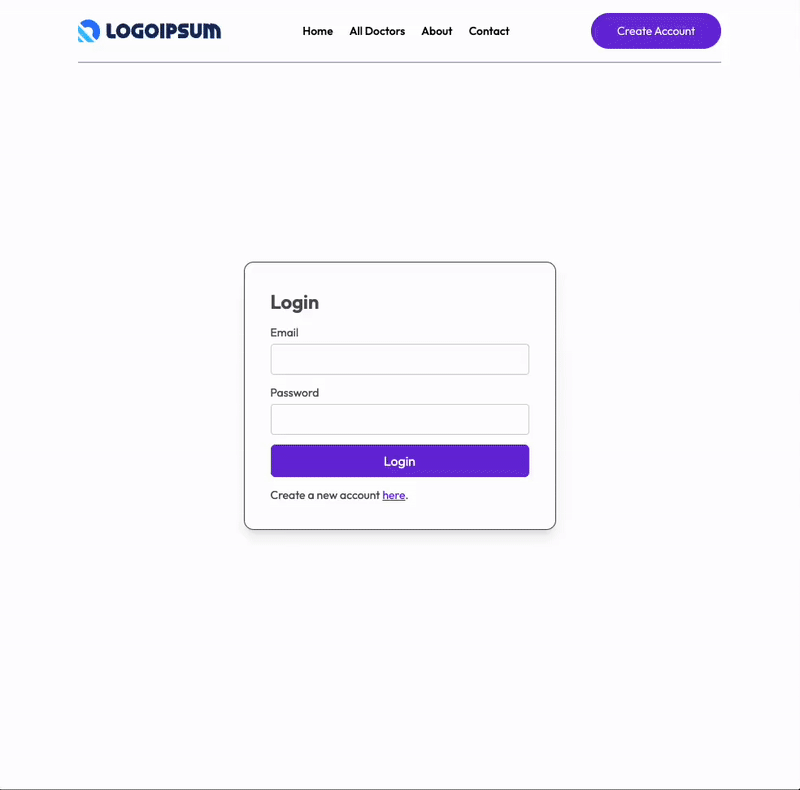
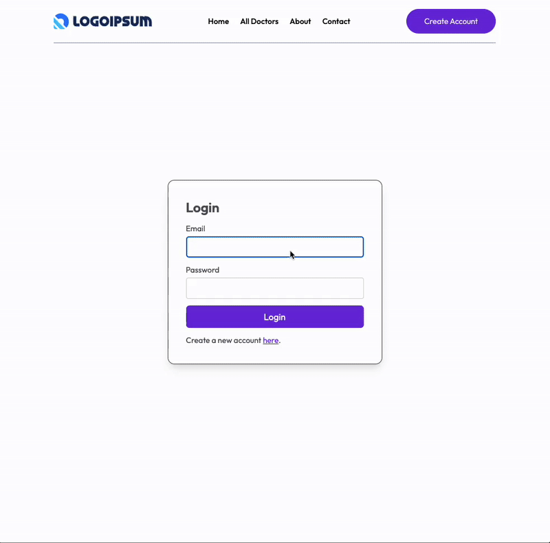
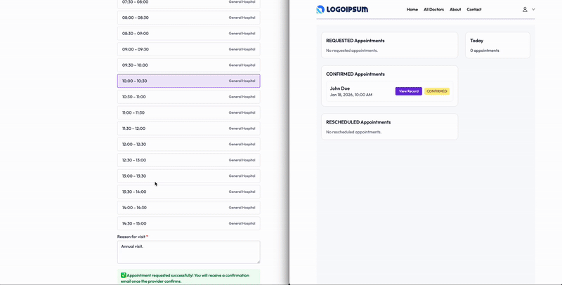

<!-- Improved compatibility of back to top link: See: https://github.com/othneildrew/Best-README-Template/pull/73 -->
<a id="readme-top"></a>
<!--
*** Thanks for checking out the Best-README-Template. If you have a suggestion
*** that would make this better, please fork the repo and create a pull request
*** or simply open an issue with the tag "enhancement".
*** Don't forget to give the project a star!
*** Thanks again! Now go create something AMAZING! :D
-->


<!-- PROJECT SHIELDS -->
<!--
*** I'm using markdown "reference style" links for readability.
*** Reference links are enclosed in brackets [ ] instead of parentheses ( ).
*** See the bottom of this document for the declaration of the reference variables
*** for contributors-url, forks-url, etc. This is an optional, concise syntax you may use.
*** https://www.markdownguide.org/basic-syntax/#reference-style-links
-->
<!-- [![Contributors][contributors-shield]][contributors-url]
[![Forks][forks-shield]][forks-url]
[![Stargazers][stars-shield]][stars-url]
[![Issues][issues-shield]][issues-url]
[![project_license][license-shield]][license-url]
[![LinkedIn][linkedin-shield]][linkedin-url] -->


<!-- PROJECT LOGO -->
<br />
<div align="center">
  <a href="https://github.com/Uye121/DocAppoint">
    
  </a>

<h3 align="center">Docappoint</h3>

  <p align="center">
    DocAppoint is a healthcare scheduling app.
    <!-- <br />
    <a href="https://github.com/Uye121/DocAppoint"><strong>Explore the docs »</strong></a>
    <br />
    <br />
    <a href="https://github.com/Uye121/DocAppoint">View Demo</a>
    &middot;
    <a href="https://github.com/Uye121/DocAppoint/issues/new?labels=bug&template=bug-report---.md">Report Bug</a>
    &middot;
    <a href="https://github.com/Uye121/DocAppoint/issues/new?labels=enhancement&template=feature-request---.md">Request Feature</a> -->
  </p>
</div>


<!-- TABLE OF CONTENTS -->
<details>
  <summary>Table of Contents</summary>
  <ol>
    <li>
      <a href="#about-the-project">About The Project</a>
      <ul>
        <li><a href="#built-with">Built With</a></li>
      </ul>
    </li>
    <li>
      <a href="#demo">Demo</a>
    </li>
    <li>
      <a href="#getting-started">Getting Started</a>
      <ul>
        <li><a href="#prerequisites">Prerequisites</a></li>
        <li><a href="#installation">Installation</a></li>
      </ul>
    </li>
    <li><a href="#usage">Usage</a></li>
    <li><a href="#roadmap">Roadmap</a></li>
    <li><a href="#compliance--security">Compliance & Security</a></li>
    <li><a href="#acknowledgments">Acknowledgments</a></li>
  </ol>
</details>


<!-- ABOUT THE PROJECT -->
## About The Project

**DocAppoint** is a patient appointment dashboard with Django REST framework and React frontend with design based on the course [Build Full Stack Doctor Appointment Booking System](https://www.youtube.com/watch?v=eRTTlS0zaW8). The application is containerized with Docker in order to provide high portability, easy scalability, and consistent deployment. All logics are kept separate and data are shared only through REST. This app is work in-progress and will be updated reguarly.

### Built With

#### Frontend
* [![Vite][Vite]][Vite-url]
* [![React][React.js]][React-url]
* [![ReactQuery][ReactQuery]][ReactQuery-url]
* [![TypeScript][TypeScript]][TypeScript-url]
* [![Tailwind][Tailwind.css]][Tailwind-url]

#### Backend
* [![Django][Django]][Django-url]
* [![Python][Python]][Python-url]

#### Misc
* [![Postgres][Postgres]][Postgres-url]
* [![Docker][Docker]][Docker-url]
* [![Pytest][Pytest]][Pytest-url]

<p align="right">(<a href="#readme-top">back to top</a>)</p>


## Demo








<p align="right">(<a href="#readme-top">back to top</a>)</p>


<!-- GETTING STARTED -->
## Getting Started

Follow the steps below to get started on this project.

### Prerequisites

You will need Docker, Django, Poetry, React, and NPM.

### Installation

1. Clone the repo
   ```sh
   git clone https://github.com/Uye121/DocAppoint.git
   ```
2. Install NPM packages
   ```sh
   cd frontend/
   npm install
   ```
2. Install Python packages
   ```sh
   cd ../backend/
   poetry install
   ```
4. Environment configuration
   ```bash
   cd ../ # go back to project root
   cp .env.example .env # Fill out environment variables with custom values
   ```
5. Run the project
   ```sh
   make dev
   ```

<p align="right">(<a href="#readme-top">back to top</a>)</p>


<!-- USAGE EXAMPLES -->
## Usage

Use this space to show useful examples of how a project can be used. Additional screenshots, code examples and demos work well in this space. You may also link to more resources.

_For more examples, please refer to the [Documentation](https://example.com)_

<p align="right">(<a href="#readme-top">back to top</a>)</p>


<!-- ROADMAP -->
## Roadmap

- [x] Authentication/Authorization
    - [x] User signup, login, logout
    - [x] Session refresh in background
    - [x] Authenticate via JWT
    - [x] Email verification
    - [x] Resend email verification
    - [x] Custom user policies
    - [ ] Reset password
- [x] User-type specific web pages
- [ ] Patient features
    - [x] View doctors' schedule
    - [x] Schedule appointment with doctors with custom notes
    - [x] Filter doctors by speciality
    - [x] Onboarding with medical information
    - [x] Update personal information
    - [ ] Chat with doctors in real-time
    - [ ] AI chatbot to give general information
- [ ] Doctor features
    - [x] Accept or reject patient appointments
    - [x] View and update User's medical records
    - [ ] Indicate whether doctors are online
    - [ ] Set availability (backend completed)
- [ ] Redis caching
- [ ] Nginx reverse proxy
- [x] Display company information
- [x] Containerize services
- [x] Data safety
    - [x] Database audit trail
    - [x] Sensitive tables soft delete
- [ ] CI/CD
    - [x] Pre-commit
    - [x] Unit test backend
    - [x] Linting
    - [x] Vitest unit tests
    - [ ] Integration tests
    - [ ] Security scanner (code + deps + image)
    - [ ] e2e test
    - [ ] Smoke test
    - [x] Build & publish artefacts
    - [ ] DB migration safety & rollback test
    - [ ] Canary / blue-green deployment
    - [ ] Observability (alerts & metrics: Grafana + Prometheus)
    - [ ] Backup & restore test
    - [ ] Rate-limit & WAF
    - [ ] Production deployment

See the [open issues](https://github.com/Uye121/DocAppoint/issues) for a full list of proposed features (and known issues).

<p align="right">(<a href="#readme-top">back to top</a>)</p>


## Compliance & Security
- HIPAA Security Rule alignment (access control, encryption in transit, audit-log, rate-limiting)

- Unique user IDs & role-based permission

- Password hashed with PBKDF2, and JWT access/refresh tokens with rotation

- HTTPS enforced

<p align="right">(<a href="#readme-top">back to top</a>)</p>


<!-- ACKNOWLEDGMENTS -->
## Acknowledgments

* [Build Full Stack Doctor Appointment Booking System](https://www.youtube.com/watch?v=eRTTlS0zaW8)

<p align="right">(<a href="#readme-top">back to top</a>)</p>


<!-- MARKDOWN LINKS & IMAGES -->
<!-- https://www.markdownguide.org/basic-syntax/#reference-style-links -->
[contributors-shield]: https://img.shields.io/github/contributors/Uye121/DocAppoint.svg?style=for-the-badge
[contributors-url]: https://github.com/Uye121/DocAppoint/graphs/contributors
[forks-shield]: https://img.shields.io/github/forks/Uye121/DocAppoint.svg?style=for-the-badge
[forks-url]: https://github.com/Uye121/DocAppoint/network/members
[stars-shield]: https://img.shields.io/github/stars/Uye121/DocAppoint.svg?style=for-the-badge
[stars-url]: https://github.com/Uye121/DocAppoint/stargazers
[issues-shield]: https://img.shields.io/github/issues/Uye121/DocAppoint.svg?style=for-the-badge
[issues-url]: https://github.com/Uye121/DocAppoint/issues
[license-shield]: https://img.shields.io/github/license/Uye121/DocAppoint.svg?style=for-the-badge
[license-url]: https://github.com/Uye121/DocAppoint/blob/master/LICENSE.txt
[linkedin-shield]: https://img.shields.io/badge/-LinkedIn-black.svg?style=for-the-badge&logo=linkedin&colorB=555
[linkedin-url]: https://linkedin.com/in/linkedin_username
[product-screenshot]: images/screenshot.png
<!-- Shields.io badges. You can a comprehensive list with many more badges at: https://github.com/inttter/md-badges -->
[Vite]: https://img.shields.io/badge/Vite-646CFF?logo=vite&logoColor=fff
[Vite-url]: https://vite.dev/
[React.js]: https://img.shields.io/badge/React-20232A?style=for-the-badge&logo=react&logoColor=61DAFB
[React-url]: https://reactjs.org/
[ReactQuery]: https://img.shields.io/badge/React%20Query-FF4154?logo=reactquery&logoColor=fff
[ReactQuery-url]: https://tanstack.com/query/latest
[TypeScript]: https://img.shields.io/badge/TypeScript-3178C6?logo=typescript&logoColor=fff
[TypeScript-url]: https://www.typescriptlang.org/
[Tailwind.css]: https://img.shields.io/badge/Tailwind%20CSS-%2338B2AC.svg?logo=tailwind-css&logoColor=white
[Tailwind-url]: https://tailwindcss.com/
[Django]: https://img.shields.io/badge/Django-%23092E20.svg?logo=django&logoColor=white
[Django-url]: https://www.django-rest-framework.org/
[Python]: https://img.shields.io/badge/Python-3776AB?logo=python&logoColor=fff
[Python-url]: https://www.python.org/
[Postgres]: https://img.shields.io/badge/Postgres-%23316192.svg?logo=postgresql&logoColor=white
[Postgres-url]: https://www.postgresql.org/
[Docker]: https://img.shields.io/badge/Docker-2496ED?logo=docker&logoColor=fff
[Docker-url]: https://www.docker.com/
[Pytest]: https://img.shields.io/badge/Pytest-fff?logo=pytest&logoColor=000
[Pytest-url]: https://docs.pytest.org/en/stable/